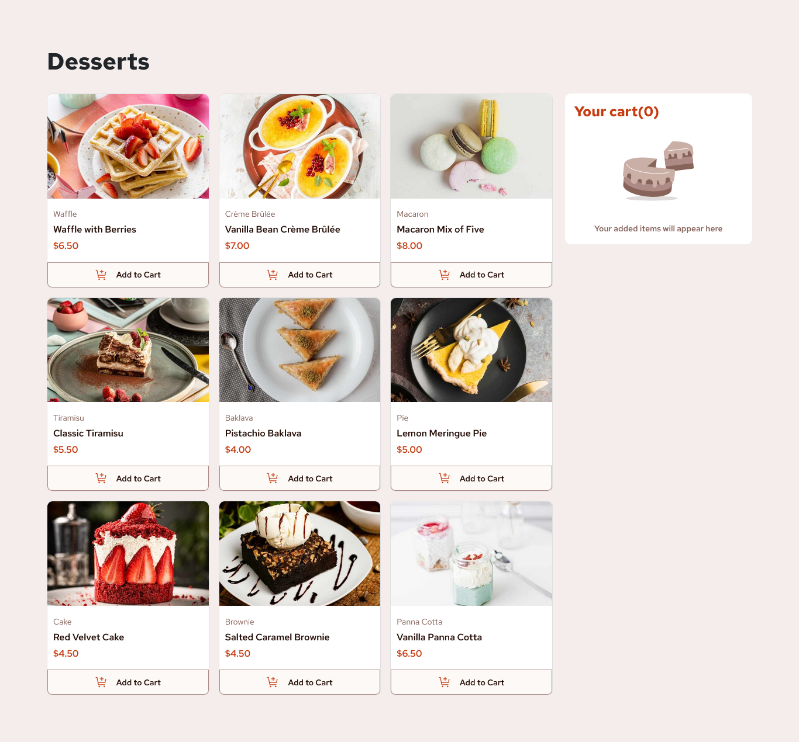

# Frontend Mentor - Product list with cart solution

This is a solution to the [Product list with cart challenge on Frontend Mentor](https://www.frontendmentor.io/challenges/product-list-with-cart-5MmqLVAp_d). Frontend Mentor challenges help you improve your coding skills by building realistic projects.

## Table of contents

- [Overview](#overview)
  - [The challenge](#the-challenge)
  - [Screenshot](#screenshot)
  - [Links](#links)
  - [Built with](#built-with)
  - [What I learned](#what-i-learned)
- [Author](#author)

## Overview

### The challenge

Users should be able to:

- Add items to the cart
- Increase/decrease the number of items in the cart
- See an order confirmation modal when they click "Confirm Order"
- Reset their selections when they click "Start New Order"
- View the optimal layout for the interface depending on their device's screen size

### Screenshot

### Links

- Solution URL: [Solution URL](https://www.frontendmentor.io/solutions/responsive-product-list-cart-build-with-vuejs-and-bootstrap-5-VM_INdjxoT)
- Live Site URL: [Live site URL](https://desert-product-list.netlify.app/)

### Built with

- Semantic HTML5 markup
- CSS custom properties
- Flexbox
- CSS Grid
- [Bootstrap 5](https://getbootstrap.com/) - CSS Framework
- [Vue.js](https://vuejs.org/) - JS Framework

### What I learned

Exploring Vue's component architecture in this project has deepened my understanding of how props and emit facilitate a clear and organized flow of data and events. This approach has proven essential for building more readable and maintainable codebases.

## Author

- Frontend Mentor - [@fella404](https://www.frontendmentor.io/profile/fella404)
